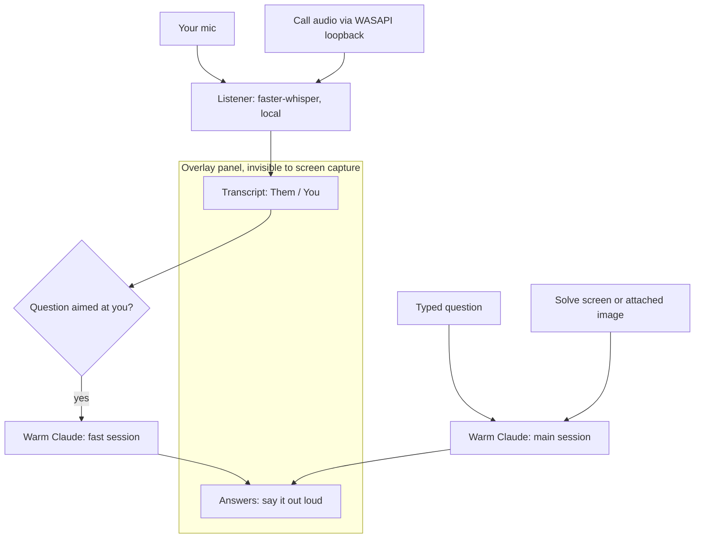

# Cluely

Cluely is a screen-capture-invisible AI overlay for your own meetings and
presentations. The panel floats on top of everything you see, but it renders
blank in Zoom screenshare, OBS, and capture-based screenshots. It does that with
`SetWindowDisplayAffinity` and the `WDA_EXCLUDEFROMCAPTURE` flag. It runs on a
warm headless Claude using your existing `claude` login, so there's no API key
and no per-token cost. It listens to the call locally and can answer questions
out loud in real time.

**Intended use:** your own meetings, demos, and presentations. Not for
interviews, exams, or any setting that measures your own unaided ability. The
backend prompt refuses to produce content meant to deceive anyone evaluating
you.

## How it works



Two audio sources feed one local transcriber. Your mic gives the `You` lines.
The call's own speaker output, captured through WASAPI loopback, gives the `Them`
lines. faster-whisper turns both into text in the `Transcript` tab. When a line
from the other side looks like a question aimed at you, Cluely sends the recent
transcript to a fast Claude session and streams a short answer into the
`Answers` tab. Typed questions and screen or image questions go to a stronger
session instead. None of the panel shows up in a screen share.

## Requirements

Cluely is Windows-only. It leans on Windows APIs: `SetWindowDisplayAffinity`
for capture exclusion, WASAPI loopback for call audio, `pythonw.exe` for the
console-less launcher, and `.lnk` shortcuts.

- Windows 10 or 11
- Python 3.10 or newer
- The Claude CLI, installed and logged in. Cluely uses your local login, so you
  don't need an API key. Check it with `claude --version`. If `claude` isn't on
  your PATH, set `CLUELY_CLAUDE_CMD` to its full path.
- A GPU is optional. Set `CLUELY_WHISPER_DEVICE=cuda` to speed up
  transcription. It falls back to CPU on its own if the CUDA libraries aren't
  there.

## Setup

From a clone of the repo:

```powershell
python -m venv .venv
.\.venv\Scripts\python.exe -m pip install -r requirements.txt
```

Then create the launcher shortcut once (optional):

```powershell
powershell -ExecutionPolicy Bypass -File scripts\install_shortcut.ps1
```

That drops a `Cluely` shortcut on your Desktop and in the Start Menu. Right-click
it to pin to the taskbar.

## Run

Double-click the `Cluely` shortcut. It launches console-less through `pythonw`.
Or run it directly:

```powershell
.\.venv\Scripts\python.exe src\main.py
```

On launch it warms the Claude session in the background. That warm-up takes about
5 to 7 seconds, once, so your first real question is fast.

## Live mode

Click the `⏻ OFF` power switch (or press `Ctrl+Alt+Space`) to start listening.
Cluely captures both sides of the call locally and transcribes them into the
`Transcript` tab. Each line is tagged `Them` for the other participants (WASAPI
loopback) or `You` for your own mic. With `Auto-answer` checked, when the other
side asks something aimed at you, Cluely streams a short say-it-out-loud answer
into the `Answers` tab. Flip the switch off the same way to stop.

The mic hears you too. A solo test still transcribes your own voice, and in a
real meeting Cluely has both halves of the conversation as context.

If you set `CLUELY_MY_NAME`, Cluely treats a line that says your name as a
question aimed at you. So "Ada, what do you think?" triggers an answer even
when whisper drops the question mark. It defaults to empty, so no name is built
into the code.

### The one setting that has to be right: Call audio

WASAPI loopback is endpoint-specific. It records exactly one speaker output, not
all sound on the machine. The `Call audio` picker chooses which one, and it has
to match the device Zoom plays the call through (Zoom, then Settings, then Audio,
then Speaker). If they differ, Cluely loopbacks a silent endpoint. It captures
zero `Them` lines and never auto-answers, and no error is shown. This is common
when you have a headset, a virtual cable, Steam streaming audio, or a second
monitor's HDMI output.

While live, the status line shows the captured device as `call: ...`. If your mic
is active but the call stays silent for about 25 seconds, it warns
`⚠ no call audio`. Pick the matching device and the warning clears. You can
switch mid-meeting and it restarts the listener.

### One answer at a time

Auto-answers never overlap. A single answer runs at a time so two can't garble
each other. If another question arrives while Cluely is still answering, the
newest one is queued and fires the instant the current answer finishes. Older
mid-answer questions are dropped, so by the time you're free the live one is the
most recent question. A question you type runs on its own and doesn't disturb the
auto queue. If a model turn ever stalls, a watchdog (`CLUELY_ANSWER_TIMEOUT`,
default 90s) kills and respawns the session so answering can't wedge.

### Echo and cross-talk guard

Cluely hears both your speakers (loopback) and your mic, so the same sentence
can land twice. Your speakers get re-heard by the mic, or mic sidetone leaks into
the loopback stream. A near-duplicate of a recent line from the other source is
treated as that echo and dropped. The transcript isn't double-logged, and your
own voice can't trigger an answer to a question that was really asked of you.
Tune or disable it with the `CLUELY_ECHO_*` vars below.

## Vision and images

Cluely can also see, which helps with anything audio can't catch. A diagram on
the shared screen, a coding problem, a chart.

- `Solve screen` (or `Ctrl+Alt+S`) captures your screen and asks Claude to read
  or solve what's on it. Cluely's own panel is excluded from that capture, so it
  never shows up in the image. Set `CLUELY_VISION_MONITOR` to pick the monitor
  (0 is all, 1 is primary, 2 is the next one).
- Attach an image three ways, all the same underneath: the `📎` button next to
  the question box, `Ctrl+V` in the question box when an image is on the
  clipboard, or the `Ctrl+Alt+I` hotkey. Each uses a copied image if one is on
  the clipboard, otherwise it opens a file picker. Whatever you typed in the box
  becomes your question about the image. Leave it empty for a default "what is
  this, solve or explain it." Images are PNG-encoded in memory with no temp
  files.

Any answer with code in it ends with a "Read aloud (line by line)" section. That's
a spoken script walking through the solution one line at a time in plain sentences
you can read out. Image questions cost more tokens, so they stay off the
auto-answer path to keep live answering fast.

## On-screen controls

The panel has two always-visible buttons on top of the hotkeys:

- `⏻ OFF` / `⏻ LIVE` is the power switch. Click to start or stop listening and
  auto-answer, same as `Ctrl+Alt+Space`. Grey is idle. Green is live.
- `×` (top-right) closes Cluely. It saves your notes first, same as
  `Ctrl+Alt+Q`.

Launching from the shortcut opens the panel idle. Flip the power switch when you
want it listening.

## Hotkeys

| Keys           | Action                              |
| -------------- | ----------------------------------- |
| Ctrl+Alt+Space | toggle live mode (listen + answer)  |
| Ctrl+Alt+H     | show / hide the overlay             |
| Ctrl+Alt+A     | show and focus the question box     |
| Ctrl+Alt+S     | capture the screen and solve it     |
| Ctrl+Alt+I     | attach an image (clipboard or file) |
| Ctrl+Alt+T     | toggle click-through (mouse passes) |
| Ctrl+Alt+Q     | save notes and quit                 |

## Speed

A cold `claude -p` pays full session-init on every call, about 5 to 7 seconds of
SessionStart hooks. Cluely keeps one `claude` process alive in stream-json input
mode, so that cost is paid once at startup. Every answer after that is just a
model round-trip, measured around 2 to 3 seconds. Voiced auto-answers run on a
separate fast session (`CLUELY_AUTO_MODEL`, default `haiku`) with a lean
preamble, so they come back quicker than typed or vision answers, which use the
stronger model.

Voiced-answer latency is roughly the capture window (at most
`CLUELY_CHUNK_SECONDS`, default 2s) plus whisper decode plus the model
round-trip. The biggest lever left is transcription. If your machine has a GPU,
set `CLUELY_WHISPER_DEVICE=cuda` to cut the decode leg.

## Troubleshooting

**Auto-answer never fires, or no `Them` lines show up.** Almost always the
`Call audio` device doesn't match Zoom's Speaker output. See the call-audio note
above and set both to the same device. Quick check: talk while live. If you see
`You:` lines but never `Them:` lines, the call endpoint is wrong.

**Your own voice triggers answers, or the transcript double-logs.** The echo
guard drops a mic line that near-duplicates recent call audio. If it's too
aggressive on your setup, raise `CLUELY_ECHO_RATIO` toward `1.0`, or turn it off
with `CLUELY_ECHO_GUARD=0`.

**A quiet or very short question gets missed.** The volume gate scores the
loudest half-second of the window rather than the whole-window average, so brief
speech survives. If a very soft speaker still gets dropped, raise mic volume or
lower `CLUELY_CHUNK_SECONDS`.

## Privacy

Cluely runs locally. Audio is transcribed on your machine with faster-whisper.
The text that goes to Claude rides the same warm `claude` login you already use
from the terminal.

Your notes, transcripts, and saved answers stay on your machine. The `notes/`
folder is gitignored and never committed. That matters because a transcript holds
other people's words from the call, and those should not leave your machine. This
repo is public, so never commit anything from `notes/`, and don't paste real
meeting content into the code or docs.

## Config

All settings are environment variables (see `src/config.py`):

- `CLUELY_CLAUDE_CMD`: full path to the Claude CLI. Defaults to `claude` on your
  PATH, then the npm-global location. Set it if `claude` isn't on your PATH.
- `CLUELY_MY_NAME`: your name, so a spoken "Ada?" counts as a question aimed
  at you. Empty by default, and each name word is matched.
- `CLUELY_CLAUDE_MODEL`: model for typed and vision (code) questions. Defaults to
  your account default.
- `CLUELY_AUTO_MODEL`: fast model for live voiced auto-answers. Default `haiku`.
  Set it to `""` to share one session with `CLUELY_CLAUDE_MODEL`.
- `CLUELY_CHUNK_SECONDS`: audio window before a line is transcribed. Lower means
  faster pickup and slightly less accuracy. Default `2.0`.
- `CLUELY_WHISPER_MODEL` / `_DEVICE` / `_COMPUTE`: transcription size and
  backend. Defaults `base.en`, `cpu`, `int8`. Set `_DEVICE=cuda` for GPU.
- `CLUELY_CAPTURE_SYSTEM` / `CLUELY_CAPTURE_MIC`: capture the other side and
  your own mic. Both default on.
- `CLUELY_SPEAKER_DEVICE` / `CLUELY_MIC_DEVICE`: pin capture devices by name.
  Defaults to the system default.
- `CLUELY_AUTO_THROTTLE` / `CLUELY_AUTO_MINCHARS`: auto-answer pacing.
- `CLUELY_AUTO_FROM`: whose lines may trigger an auto-answer. One of `them`,
  `you`, or `both`. Default `them`.
- `CLUELY_ANSWER_TIMEOUT`: seconds before a stalled model turn is killed and the
  session respawned. Default `90`.
- `CLUELY_ECHO_GUARD`: drop near-duplicate cross-source lines (echo or
  sidetone). `1` on (default), `0` off.
- `CLUELY_ECHO_WINDOW` / `CLUELY_ECHO_RATIO`: echo lookback seconds (default
  `6`) and similarity threshold from 0 to 1 (default `0.80`).
- `CLUELY_VISION_MONITOR`: which screen `Solve screen` captures. Default `1`.
- `CLUELY_OPACITY`: panel opacity.

## License

Apache-2.0. See [LICENSE](LICENSE).
